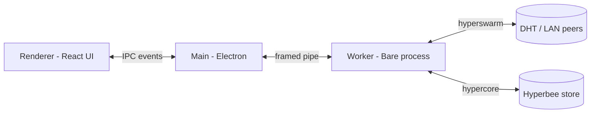

# MeshDesk

Local-first, peer-to-peer file sharing and workflow tool built on Electron & P2P swarms.

- **Zero-cloud architecture** — devices talk directly over the DHT; no accounts, no servers
- **End-to-End Encrypted (E2EE)** — every connection is authenticated with the Noise protocol
- **Local network auto-discovery** — paired devices find each other on LAN instantly
- **Multi-platform** — Windows, macOS, Linux

## Architecture

MeshDesk splits into three processes with a strict trust boundary:

- **Main Process (Electron):** Window lifecycle, tray integration, auto-updater (`electron-updater` with a GitHub Releases feed), and WebDAV/CLI shell integration.
- **Background Worker Process:** An isolated Bare worker runs the P2P swarm (hyperswarm), persists state to Hyperbee, and verifies every pairing handshake. The worker is the only process that touches the network or the key store.
- **Renderer Process:** React + Tailwind UI. It communicates with the worker exclusively through gated IPC events — no Node access, `contextIsolation` enabled.



## Key Features

- **Code-based pairing** — 80-bit one-time codes (`MD-XXXX-XXXX-XXXX-XXXX`) with QR support; trust is granted only after a keyed MAC challenge-response
- **LAN auto-trust bypass** — local-network peers skip the handshake when autoTrustLAN is enabled
- **One-time anonymous drops** — single-use `DROP-` codes with live countdown and revocation, no pairing required
- **Resumable transfers** — chunk-scheduled downloads with SHA-256 block verification and resume after interruption
- **Clipboard sync** — shared clipboard across paired devices
- **Background diagnostics poller** — live peer counts, latency, and packet loss without fabrication
- **Auto-updating release pipeline** — silent background downloads via `electron-updater`, GitHub Actions multi-platform builds

**Tech stack:** Electron · React · TypeScript · Vite · Tailwind CSS · electron-builder · hyperswarm · hypercore · Hyperbee

## Developer Quickstart

Prerequisites: **Node.js 20+**

```bash
npm install
npm run dev:multi
```

`dev:multi` boots two peer instances side-by-side (window A and window B) for real-time local P2P testing — pair them with a code from either dashboard and watch transfers flow over the LAN discovery path.

```bash
npm test          # engine test suite (pairing, claims, transfers, storage)
npm run build:pack      # local packaged app (electron-builder, no publish)
npm run build:release   # package + upload to GitHub Releases
```

For release builds, set `GH_UPDATE_OWNER` / `GH_UPDATE_REPO` (the workflow maps them automatically) and push a `v*.*.*` tag.

## License & Disclaimer

MIT License — see [LICENSE](LICENSE).

This is an independent, open-source project. It is not affiliated with or endorsed by any of the referenced protocols or libraries. Use at your own risk; the authors are not liable for any data loss or damage.
