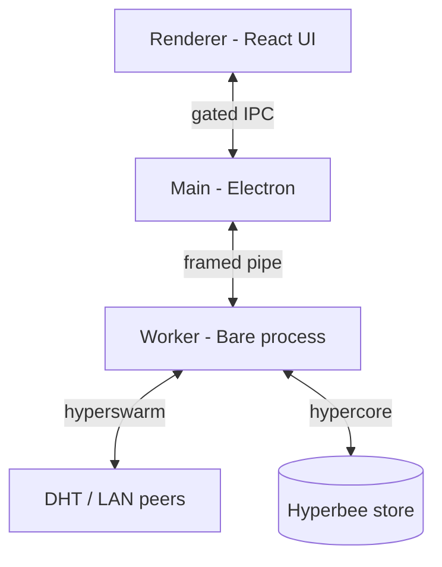

# MeshDesk

Local-first, peer-to-peer file sharing between your own devices. No accounts, no cloud, end-to-end encrypted.

## Project Overview

MeshDesk is an Electron desktop app for sharing files directly between devices you own. Devices connect peer-to-peer: over the local network when they are near each other, or across the internet through the public DHT when they are not. There are no accounts, no third-party servers, and no cloud uploads — every connection is end-to-end encrypted.

Pairing is code-based. Enter a short `MD-` code (or scan a QR code) and the two devices authenticate each other by proving knowledge of the code. For one-off sharing, single-use `DROP-` codes hand a file to any other MeshDesk device without pairing.

## Why MeshDesk?

- **Privacy by default** — devices talk directly to each other. No third-party server ever sees your files, metadata, or keys.
- **Pairing without accounts** — no sign-up, no profiles, no cloud relay to configure. A code or a QR scan is all it takes, and paired devices reconnect automatically.
- **Your LAN or the internet** — paired devices discover each other on the local network instantly; the DHT (with relay fallback for restrictive NATs) covers the rest.
- **Resumable transfers** — chunked transfers with per-block SHA-256 verification resume from the last verified block after an interruption.

## Current Status

Active development. The first public release targets Windows. macOS and Linux are architecturally supported and will follow in later releases once they are properly tested and packaged.

## Supported Platforms

| Platform | Status                                 |
| -------- | -------------------------------------- |
| Windows  | ✅ current public release              |
| macOS    | ⏳ planned (architecturally supported) |
| Linux    | ⏳ planned (architecturally supported) |
| Mobile   | ❌ not planned                         |

Windows is the initial release platform. macOS and Linux builds will follow once properly tested and packaged; a mobile version is not planned.

## Windows Release

The Windows release ships as an NSIS installer:

- **Per-user install** — installs under `%LOCALAPPDATA%\Programs` without administrator rights.
- **Auto-updates** — `electron-updater` checks GitHub Releases in the background and installs updates silently.
- **`latest.yml` metadata** — published with every release so the updater can resolve the current version.

## Current Features

- **Code-based pairing with E2EE** — `MD-` pairing codes backed by a keyed-MAC challenge-response handshake: trust is granted only after a peer proves knowledge of the code (BLAKE2b MAC over a random nonce). Codes expire after 15 minutes.
- **QR-code pairing** — display your pairing code as a QR code, or scan another device's code with the camera.
- **LAN auto-discovery** — paired devices announce themselves on the local network; an optional LAN auto-trust setting bypasses the pairing handshake for local peers.
- **One-time anonymous DROP codes** — single-use `DROP-` codes with a live countdown, expiration, and revocation; no pairing required on either side.
- **Resumable chunked transfers** — chunk-scheduled transfers with per-block and whole-file SHA-256 verification; interrupted transfers resume from the last verified block.
- **Clipboard sync** — copy on one paired device, paste on another.
- **Live diagnostics** — connected peer counts, average latency, and packet loss surfaced in the UI.
- **Auto-update pipeline** — `electron-updater` with a GitHub Releases feed and a GitHub Actions workflow that builds release artifacts for Windows, macOS, and Linux on tag push.

## Upcoming Features / Roadmap

- **WebDAV "Unified Drive"** — a local WebDAV server exists in the codebase but is deliberately not started; no UI consumes it yet. Planned to be exposed as a permission-gated drive once the feature is built out.
- **Continuous folder sync ("MeshDrive")** — not yet implemented.
- **Remote access / remote desktop** — not yet implemented.
- **macOS and Linux packaged releases** — CI builds exist for both; shipping them is planned for a future release.

## Screenshots

Screenshots coming soon. A preview image (`images/1.png`) is available in the repository.

## Installation

Windows: download the installer from the latest [GitHub Release](https://github.com/aamirali51/MeshDesk/releases) and run it. The installer is per-user — no administrator rights required — and the app keeps itself up to date automatically.

## Development Setup

Prerequisites: Node.js 20+.

```bash
npm install
npm run dev:multi
```

`dev:multi` boots two peer instances side-by-side (window A and window B) for real-time local P2P testing — pair them with a code from either dashboard and watch transfers flow over the LAN discovery path.

```bash
npm test     # engine test suite (pairing, claims, transfers, storage)
```

## Building from Source

```bash
npm run build:pack        # local packaged app (electron-builder, no publish)
npm run build:release     # package + upload to GitHub Releases
```

For release builds, set `GH_UPDATE_OWNER` and `GH_UPDATE_REPO`, then push a `v*.*.*` tag. The GitHub Actions workflow maps those variables automatically and runs the multi-OS build matrix.

## Architecture

MeshDesk splits into three processes with a strict trust boundary:

- **Main Process (Electron)** — window lifecycle, tray integration, and the auto-updater (`electron-updater` with a GitHub Releases feed).
- **Background Worker** — an isolated Bare process that runs the P2P swarm (hyperswarm), persists state to Hyperbee, and verifies every pairing handshake. It is the only process that touches the network or the key store.
- **Renderer** — React + Tailwind UI that communicates with the worker exclusively through gated IPC (`contextIsolation` enabled, no Node access).



## Technology Stack

Electron · React · TypeScript · Vite · Tailwind CSS · electron-builder · hyperswarm · hypercore · Hyperbee

## Security & Privacy

- **End-to-end encrypted** — every connection is authenticated with the Noise protocol (`Noise_XX_25519_ChaChaPoly_BLAKE2b`).
- **Pairing requires proof of the code** — trust is granted only after a keyed-MAC challenge-response; the code itself is never transmitted.
- **No accounts, no telemetry** — the app contacts the network only for peer discovery and update checks.
- **Data stays local** — device records and transfer state persist in a local Hyperbee store.
- **One-time drops leave no records** — DROP-code shares are anonymous and leave no persistent device records on the receiver's machine.

## Project Structure

```
electron/           Main process: window, tray, IPC, auto-updater, LAN discovery
workers/            Bare worker: hyperswarm swarm, Hyperbee persistence, engines
renderer/src/       React + Tailwind UI (pages, components, hooks)
src/shared/         Protocol definitions shared across processes
scripts/            Engine tests, dev helpers, release tooling
.github/            GitHub Actions workflow (multi-OS release builds)
```

## FAQ

**Is my data stored anywhere?** Not in the cloud. Files transfer directly between devices; the app persists only local state (device records, transfer logs) in a local Hyperbee store. The DHT is used purely for discovery and routing.

**Can I share with people who don't have MeshDesk?** No. One-time DROP codes require the receiver to run MeshDesk too — transfers happen peer-to-peer, so both ends need the app.

**Does it work over the internet?** Yes. Paired devices connect directly through the public DHT. On restrictive networks (symmetric NAT, TCP-only VPNs) the connection falls back to a DHT relay that tunnels the encrypted stream over TCP.

**When is macOS/Linux support coming?** Both are architecturally supported and CI builds already exist, but the first public release is Windows-only. macOS and Linux will ship after they are properly tested and packaged.

**Is there a mobile app?** No, and none is planned. MeshDesk targets desktop platforms.

**Why Windows first?** Windows is the primary development and testing target and has the simplest installer story for an initial release (per-user NSIS, no code-signing friction). Other desktop platforms follow once packaging and testing are stable.

## Contributing

Issues and pull requests are welcome. Before submitting, run `npm test` and make sure Prettier formatting and TypeScript (`tsc`) checks pass.

## License

MIT — see [LICENSE](LICENSE). Copyright (c) 2026 aamirali51.
